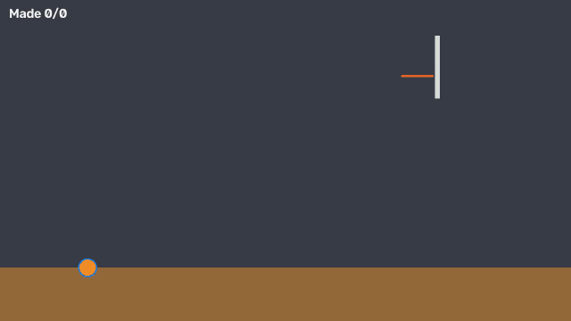
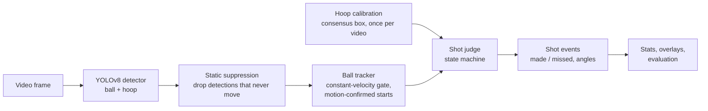
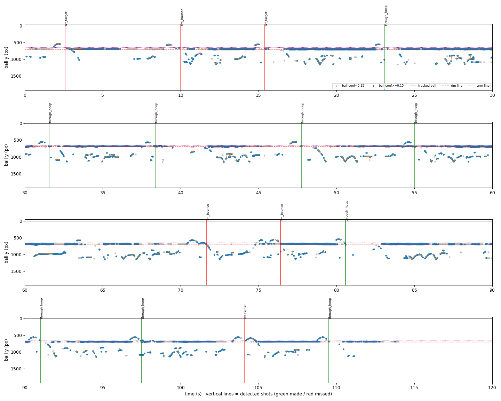

# 🏀 Basketball Shot Tracker

[](https://github.com/NathanielRecto/Basketball-Shot-Tracker/actions/workflows/tests.yml)


Computer-vision system that watches basketball video from a fixed phone camera, finds every
shot and calls it **made or missed**, with release and entry angles. Python, YOLOv8, OpenCV,
NumPy, MediaPipe.

**Held-out test accuracy: 77.7%** end-to-end on 103 hand-labelled shots from 16 public phone
videos (95% CI 69–85%), first look, original system. After retraining the detector on licensed
phone footage of busy gyms and reworking the tracker, a **re-test of the frozen system** scores
**92.2%** (95% CI 85–96%) on those same test videos and **78.2%** (95% CI 70–85%) on 119 shots
from our **own, harder iPhone footage** (camera under the hoop, three people on court; 13.4%
originally). Re-tests, because both sets had been scored before; nothing was tuned on them.
Details below.

<p align="center">
  
  <br><sub>The full pipeline on <b>simulated</b> shots (make, miss, ball hidden by the net, rim-out, rim bounce).
  The real evaluation videos cannot be redistributed; a real-footage demo is on the roadmap.</sub>
</p>

## Results

16 real phone videos (1080×1920, ~60 fps; indoor/outdoor, ground/tripod camera, free throws and
three-pointers). Every shot was labelled by hand **before** looking at any tracker output. 8
videos were used for debugging and tuning (**dev**); 8 were held out and scored **once**, after
all tuning was frozen (**test**). Each half has one video of every setup.

| | Dev (tuned on) | **Test (held out)** |
|---|---|---|
| Labelled shots | 98 | **103** |
| **End-to-end accuracy** (shot found *and* called right) | 88.8% (95% CI 81–94%) | **77.7% (95% CI 69–85%)** |
| Shot detection precision / recall | 100% / 92.9% | **98.8% / 82.5%** |
| Make/miss accuracy on found shots | 95.6% | **94.1%** |
| Mean abs. error in makes per video | 0.62 | **1.00** (an earlier published system on the same videos: 1.62) |

Test accuracy by setup: indoor **88.5%**, outdoor **66.7%**; free throws 84.5%, three-pointers
68.9%. The gap is almost entirely **shots never found outdoors**: the baseline detector was
trained on ~4 mostly indoor/broadcast source videos. The retrained detector v2 fixed most of it
(outdoor 90.2% on re-test, see below).

**📊 Full results: [docs/RESULTS.md](docs/RESULTS.md)**: training curves per epoch (detector v1 and v2), precision-recall
and F1 curves, confusion matrices, precision / recall / F1 for shot detection and made vs missed,
confidence intervals (including a video-level bootstrap), and why k-fold cross-validation is not
the right tool here.

<p align="center">
  
</p>

### Own iPhone footage (harder: camera under the hoop, three people on court)

4 indoor sessions filmed with an iPhone 11 (1 dev, 3 test; 162 shots labelled blind, with shot
type). The original tracker found only 1 in 5 shots: the detector fires on heads and legs, and the
single-target tracker locked onto them. **Tracker v2** (tuned on the dev session only) follows
side tracks and switches to a fast-rising one, and waits for a ball that left through the top of
the frame.

**Detector v2** was then fine-tuned on 5,324 extra frames of phone video from gyms with many
people on court ([Basketball Detection v6](https://universe.roboflow.com/hooper-ibdsr/basketball-detection-v6),
CC BY 4.0), so heads and legs stop looking like balls.

| Test sessions 2–4 (119 shots) | Old detector, old tracker | Old detector, tracker v2 | **Current system** |
|---|---|---|---|
| End-to-end accuracy (95% CI) | 13.4% (8–21%) | 37.8% (30–47%) | **78.2% (70–85%)** |
| Shot detection precision / recall | 95.7% / 18.5% | 100% / 44.5% | **98.1% / 86.6%** |
| Make/miss accuracy on found shots | 72.7% | 84.9% | **90.3%** |
| Free throws / mid-range / threes | | 60% / 39% / 22% | **77% / 71% / 87%** |

The current system on the public test videos: **92.2%** end-to-end (was 77.7%), outdoor 90.2%
(was 66.7%). Both are re-tests of a frozen system (see above). On development footage, accuracy
holds at 20 frames per second and, for landscape video, at 640 px input: the target for the
phone app. Full write-up: [docs/RESULTS.md §5–6](docs/RESULTS.md#6-current-system-retrained-detector--tracker-v2-october-2026).

## Data splits

Separate datasets, never mixed: the detector was **not** trained on any of the 16
evaluation videos.

| Data | Used for | Split | How it was split |
|---|---|---|---|
| **"hotshot" detector dataset** (3,625 images, CC BY 4.0) | Training the ball/hoop detector | 3,023 train / 190 validation / 412 test images | The dataset publisher's own split (Roboflow export), not ours. Its test images come from the same source videos as its training images, so its test mAP (0.970) is inflated; the validation numbers are the honest detector metrics |
| **"Basketball Detection v6" by Hooper** (48,110 images, CC BY 4.0) | Retraining the detector (v2): phone video of gyms with many people | Every 8th frame: 5,324 train / 690 validation | Ours: validation = whole blocks of 2,000 consecutive frames, so near-identical neighbours never land on both sides. Rim-only hoop boxes kept as a separate class |
| **16 phone videos** (201 hand-labelled shots) | Measuring the whole system's make/miss accuracy | **Dev** (98 shots): videos 1, 4, 5, 8, 9, 12, 13, 16<br>**Test** (103 shots): videos 2, 3, 6, 7, 10, 11, 14, 15 | By **whole video** (frames of one video never land on both sides), fixed before any tuning, balanced so each half has one video of every setup (indoor/outdoor × ground/tripod camera × free throw/three-pointer). Dev for debugging and tuning; test scored once at the end |

| **Own iPhone sessions** (162 hand-labelled shots) | Measuring the system on our own footage | **Dev** (43 shots): session 1<br>**Test** (119 shots): sessions 2, 3, 4 | By whole session, fixed before any tuning; session 1 (two balls in play at times) is dev. Videos not published |

Per-video details: [docs/RESULTS.md](docs/RESULTS.md#data-splits).

## How it works



The shot judge is a small state machine (idle → flight → confirm / rattle) built on physics
rather than on a second learned model:

* **Projectile fit against time** (x linear, y quadratic) with outlier rejection that keeps
  removing points until the arc is tight *and* curves the way gravity does.
* **Rim crossing**: interpolated between the two frames that straddle the rim line, or
  extrapolated from the fitted arc when the net or backboard hides the ball.
* **Net braking**: a ball that goes through the net is slowed by it. A "centred" ball that is
  still free-falling after the rim actually dropped in front of or behind it (a side camera
  cannot see depth), so it is a miss.
* **Rim rattle**: after the ball touches the rim the judge waits for it to settle, so a bounce
  that drops in is one make and a pop-out is one miss (never two shots).
* **Fixed-camera tricks**: the hoop is located once per video from many weak detections; a
  detection that stays in one spot (a round rim bracket, a spare ball) is ignored; weak ball
  detections may start a track only when motion between frames confirms them.
* All thresholds are relative to hoop size and in seconds, so they carry across resolutions and
  frame rates.

### Example: one video, frame by frame

<p align="center">
  
  <br><sub>Ball height over time in a dev video (derived detection data, no video frames). Each short
  arc above the dotted line is a shot; vertical lines are the tracker's calls (green made, red missed).
  The flat band on the rim line is a false "ball" on the rim's mounting bracket, which the static filter ignores.</sub>
</p>

## Engineering highlights

* **Honest evaluation**: blind hand labels, a dev/test split decided before tuning, scored once,
  with 95% confidence intervals and per-setup breakdowns.
* **Fast iteration loop**: every detection is saved once, so tracker changes are re-scored
  against the labels in seconds instead of re-running the detector for minutes per video.
* **Error analysis tooling**: the judge logs every decision (armed, aborted and why, rim
  contact, call); a replay tool lists every visible ball arc next to what the tracker decided.
* **Synthetic simulator** for the judging logic (makes, misses, rim-outs, bounces, rattle-ins,
  occlusion, noise, dropped detections) used by the tests and a stress benchmark.
* **77 tests** (unit, integration, end-to-end) run on every push via GitHub Actions.
* Clean licensing: datasets and dependencies credited in `THIRD_PARTY.md`; no third-party
  videos or images are redistributed.

## Quick start

```powershell
py -3.10 -m venv .venv
.venv\Scripts\activate
pip install -r requirements-dev.txt
pytest                                   # 77 tests
python -m shottracker demo --out outputs/demo
```

`demo` runs the whole pipeline on simulated shots and writes `outputs/demo/annotated.mp4` and
`summary.json`. No model or GPU needed.

### On real video

```powershell
pip install torch torchvision --index-url https://download.pytorch.org/whl/cu126   # CUDA build
pip install -r requirements-ml.txt
python scripts/train_detector.py --data data/hotshot/data_local.yaml --epochs 30
python -m shottracker run clip.mp4 --weights runs/detect/baseline/weights/best.pt --imgsz 1280 --hoop auto --out outputs/clip
```

`--hoop auto` locates the hoop once for the whole fixed-camera video; `--hoop x1,y1,x2,y2` sets it
by hand (`scripts/mark_hoop.py` lets you drag a box). Use `--imgsz 1280` for tall phone video.

### Speed (GTX 1660 SUPER)

| Stage | Throughput |
|---|---|
| Detector, yolov8s at 1280 px (setting used for the results) | 32 frames/s |
| Detector at 960 px / 640 px | 54 / 91 frames/s |
| Tracking + shot judging | ~20,000 frames/s |

The judging logic works from 24 to 60 fps, so processing a 60 fps camera every other frame
runs in real time.

## Measuring accuracy yourself

1. Label shots by watching each video and pressing **M** (made) or **X** (missed) when the ball
   reaches the hoop: `python scripts/label_shots.py 1 4 5 8` (guide: `docs/labeling.md`).
2. Run the tracker: `python scripts/run_eval_videos.py --weights runs/detect/baseline/weights/best.pt --imgsz 1280 --stride 2 --calibrate-hoop`
3. Score it: `python scripts/evaluate.py --videos 1 4 5 8`

`evaluate.py` reports precision / recall, make/miss accuracy, end-to-end accuracy with a 95%
confidence interval, accuracy by setup, and writes `errors.csv` listing every missed, invented or
wrongly called shot with its timestamp.

### Debugging tools (dev videos only)

| Script | What it does |
|---|---|
| `scripts/debug_video.py` | Runs the detector once, saves every ball detection and plots ball height over time against the rim |
| `scripts/replay_debug.py --arcs` | Re-runs tracking + judging from saved detections in seconds; lists every visible arc with the tracker's decision or logged reason |
| `scripts/replay_eval.py --errors` | Scores the current code against labels in seconds, with context for each error |
| `scripts/replay_all.py` | Compares settings across videos; flags shots that match no visible arc |
| `scripts/eval_synthetic.py` | Stress-tests the judging logic on simulated shots with noise and missed detections |
| `scripts/export_app_fixtures.py` | Exports settings + golden test cases the phone app's port must reproduce exactly ([docs/app_port.md](docs/app_port.md)) |
| `scripts/compare_runs.py` | Scores several runs (e.g. old vs new tracker or detector) on the same labelled shots, side by side |
| `scripts/make_report.py` | Rebuilds the figures and metrics in `docs/RESULTS.md` sections 1–4 and the detector v2 training charts |

## More detail

### Detector

**Current (v2):** fine-tuned from the baseline for 12 epochs at 960 px on hotshot + 5,324 Hooper
frames (`scripts/build_combined_dataset.py`), batch 2, 8.0 h on a GTX 1660 SUPER; validation mAP50
0.851 (ball 0.747, hoop 0.931) on 880 held-out images. The best epoch was the last and validation
metrics were still rising, so more epochs would likely help a little. Per-epoch curves and charts:
[docs/RESULTS.md §6](docs/RESULTS.md#detector-v2).

**Baseline (v1)**, yolov8s, 30 epochs on the CC BY 4.0 "hotshot" dataset:

| Split | mAP50 | mAP50-95 | Note |
|---|---|---|---|
| Validation | 0.882 | 0.403 | ball 0.81, hoop 0.95 |
| Test | 0.970 | 0.637 | **inflated**: that dataset's test frames come from the same source videos as its training frames |

### How the dev score moved

| Change (each justified by labels or physics, measured on dev only) | Dev end-to-end |
|---|---|
| First run against labels | 76.5% |
| + long misses counted as attempts; made-zone matched to labelled makes | 82.7% |
| + net-braking check | 85.7% |
| + rim-rattle state | 87.8% (replay) / 88.8% (live) |

Earlier, before labels existed, the same tooling found and fixed a wrong rim-line position, a
persistent false "ball" on the rim bracket, and weak in-flight detections being ignored
(shots found on dev: 69 → 85 of 98).

### Judging logic on synthetic shots

400 simulated shots per row (makes, misses, rim-outs, rim bounces, rattle-ins, and "fall past"
misses that look centred from the side; half with the ball hidden near the rim):

| Detection noise | Missed detections | FPS | Correct |
|---|---|---|---|
| 0 px | 0% | 30 | 96.0% |
| 1.5 px | 10% | 30 | 95.8% |
| 3 px | 20% | 30 | 95.5% |
| 5 px | 30% | 30 | 92.8% |

Nearly all simulated errors are "fall past" misses where the ball is hidden right after the rim:
net braking needs to *see* the ball falling (100% caught when visible, 0% when hidden). This tests
the logic on the project's own simulator, not real-world accuracy.

## Assumptions and limits

* Fixed camera, hoop in frame. Best from the side; a camera under the hoop facing the court is
  harder (78.2% on re-test vs 92.2% on side-on video, see above). Angles are 2D projections.
* One ball in play. Jump shots and free throws: **layups, bank shots and tip-ins are not
  specifically handled**.
* A call comes ~0.45 s after the ball crosses the rim (up to ~2 s after a rim contact, while the
  ball settles).
* Elbow / knee angles from MediaPipe pose are implemented but **not yet validated** on real shots.
* The "rim line" sits near the top of the hoop box because the training labels cover the rim *and*
  the net (`rim_line_frac` in `config.py`).

## Layout

```
src/shottracker/
  shot_logic.py    make/miss state machine (pure logic, logs every decision)
  geometry.py      Box, joint angle, projectile fit
  tracking.py      BallTracker, StaticSuppressor, HoopLocator
  calibration.py   per-video hoop location (fixed camera)
  biomechanics.py  pose-based form metrics (experimental)
  evaluation.py    matching predictions to labels, metrics
  detector.py      YOLO wrapper      pose.py  MediaPipe wrapper
  pipeline.py      glue              render.py / video.py / cli.py
  sim.py           simulated shots for tests and the demo
scripts/           training, labelling, hoop marking, evaluation, debugging
tests/             94 tests
docs/labeling.md   how to label evaluation videos
```

## Roadmap

1. **Own footage** (in progress): 4 indoor sessions filmed and scored, detector retrained (above).
   Next: film 2–3 fresh test sessions, ideally another gym or camera spot, with room above the rim
   ([filming checklist](docs/filming_checklist.md)), for a clean first-look number (both current
   test sets have been used).
2. **iPhone app** ([Basketball-Shot-Tracker-App](https://github.com/NathanielRecto/Basketball-Shot-Tracker-App), Expo / React Native). Done: tracker logic
   ported and verified identical to Python, hoop setup on the camera, a demo replay through the real tracker,
   session summary, history with FG% trend, session types (FT / mid-range / threes / freestyle), light and dark
   themes. Next: run detector v2 on the phone for live MADE / MISSED calls.
3. Validate release / entry angles and pose metrics against ground truth.
4. Layup / close-range shot mode.

## License and credits

AGPL-3.0 (see `LICENSE`), required by the Ultralytics dependency. Datasets, evaluation videos,
dependencies and prior art are credited in [`THIRD_PARTY.md`](THIRD_PARTY.md).
