# Results

Two models are evaluated separately:

1. **The detector** (YOLOv8s) finds the ball and hoop in each frame. Standard object-detection
   metrics: loss curves, precision, recall, mAP, PR / F1 curves, confusion matrix.
2. **The full shot tracker** (detector + tracking + physics-based judging) turns a video into a
   list of shots with made / missed calls. Scored against hand labels: confusion matrix,
   precision / recall / F1, accuracy and confidence intervals.

Sections 1–4 cover the public phone videos with the original system; section 5 covers our own
iPhone footage; section 6 covers the current system (retrained detector) on both. Regenerate
the figures and numbers in sections 1–4 with `python scripts/make_report.py`
(raw numbers: [`results_metrics.json`](results_metrics.json)).

## Data splits

| Data | Split | Notes |
|---|---|---|
| Detector dataset ("hotshot", CC BY 4.0) | 3,023 train / 190 validation / 412 test images | Publisher's split. The test images share source videos with the training images (checked by file name), so only validation metrics are reported as headline detector numbers |
| Evaluation videos | 8 dev / 8 test videos, 98 / 103 hand-labelled shots | Split by whole video before any tuning, one video of every setup per half. The detector never trained on any of them |

| Video | Split | Court | Camera | Shot type | Length | Shots labelled (made) |
|---|---|---|---|---|---|---|
| 1 | Dev | Outdoors | ground, right side | free throws | 1:54 | 16 (10) |
| 4 | Dev | Outdoors | ground, left side | three-pointers | 1:43 | 13 (1) |
| 5 | Dev | Outdoors | tripod (1.5 m), right side | free throws | 1:30 | 13 (8) |
| 8 | Dev | Outdoors | tripod (1.5 m), left side | three-pointers | 1:22 | 8 (2) |
| 9 | Dev | Indoors | ground, right side | free throws | 1:56 | 15 (7) |
| 12 | Dev | Indoors | ground, left side | three-pointers | 1:00 | 7 (1) |
| 13 | Dev | Indoors | tripod (1.5 m), right side | free throws | 1:32 | 19 (10) |
| 16 | Dev | Indoors | tripod (1.5 m), left side | three-pointers | 1:00 | 7 (2) |
| 2 | Test | Outdoors | ground, right side | three-pointers | 1:39 | 12 (4) |
| 3 | Test | Outdoors | ground, left side | free throws | 1:41 | 12 (9) |
| 6 | Test | Outdoors | tripod (1.5 m), right side | three-pointers | 2:02 | 11 (4) |
| 7 | Test | Outdoors | tripod (1.5 m), left side | free throws | 1:48 | 16 (5) |
| 10 | Test | Indoors | ground, right side | three-pointers | 1:19 | 10 (5) |
| 11 | Test | Indoors | ground, left side | free throws | 1:58 | 14 (4) |
| 14 | Test | Indoors | tripod (1.5 m), right side | three-pointers | 1:43 | 12 (4) |
| 15 | Test | Indoors | tripod (1.5 m), left side | free throws | 1:55 | 16 (8) |

## 1. Detector training

This section is the original detector (v1). The retrained detector v2 that the current system uses,
with its own per-epoch curves, is in [section 6](#detector-v2).

| Setting | Value |
|---|---|
| Model | YOLOv8s (11.1 M parameters), fine-tuned from COCO weights |
| Data | "hotshot" basketball dataset, CC BY 4.0: 3,023 train / 190 validation images, classes `basketball`, `basketball-hoop` |
| Epochs | 30 (early-stopping patience 10, not triggered) |
| Best epoch | **29** (Ultralytics fitness = 0.1·mAP50 + 0.9·mAP50-95) |
| Batch / image size | 8 / 640 px, fp32 |
| Training time | 3.8 h on a GTX 1660 SUPER (6 GB) |

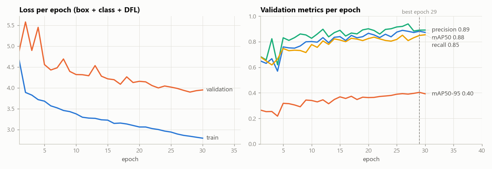

* Training loss falls steadily; validation loss falls until about epoch 25 and then flattens:
  no sign of the model memorizing the training set (validation loss rising) within 30 epochs.
* Validation metrics were still creeping up at the end, so a few more epochs might add a little,
  but more varied data matters more (see section 3).

Best-epoch validation metrics:

| | Precision | Recall | mAP50 | mAP50-95 |
|---|---|---|---|---|
| All classes | 0.891 | 0.849 | 0.882 | 0.404 |
| Ball | 0.897 | 0.726 | 0.812 | 0.375 |
| Hoop | 0.884 | 0.972 | 0.951 | 0.431 |

The ball is the harder class: it is small (about 23 px wide at 640 px) and blurred in flight.

| Precision-recall curve | F1 vs confidence | Confusion matrix (normalized) |
|---|---|---|
| 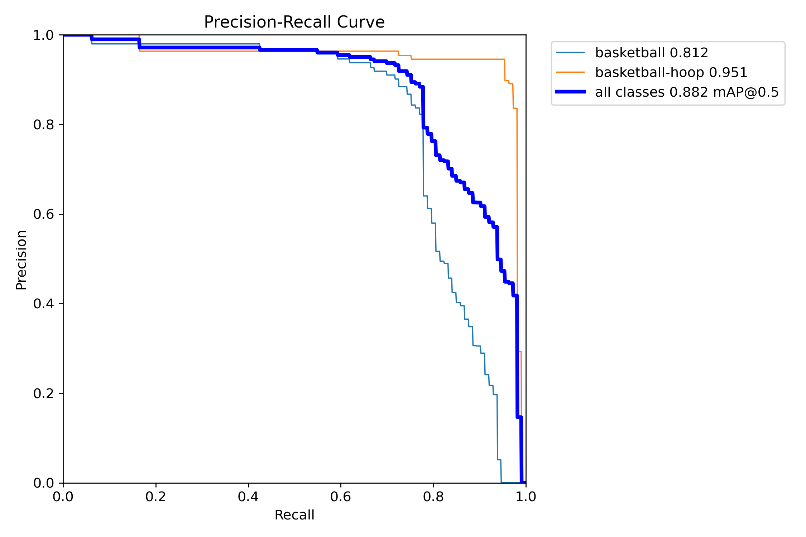 | 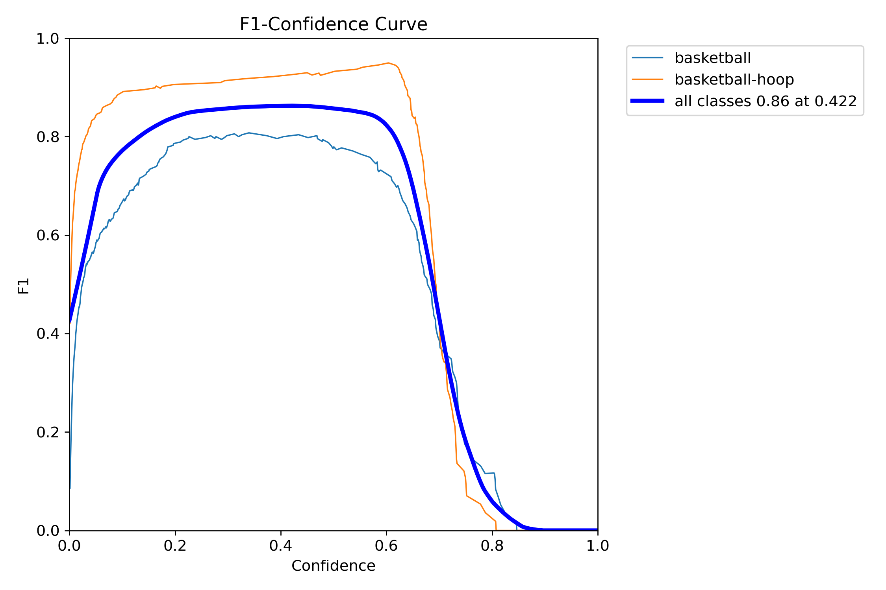 | 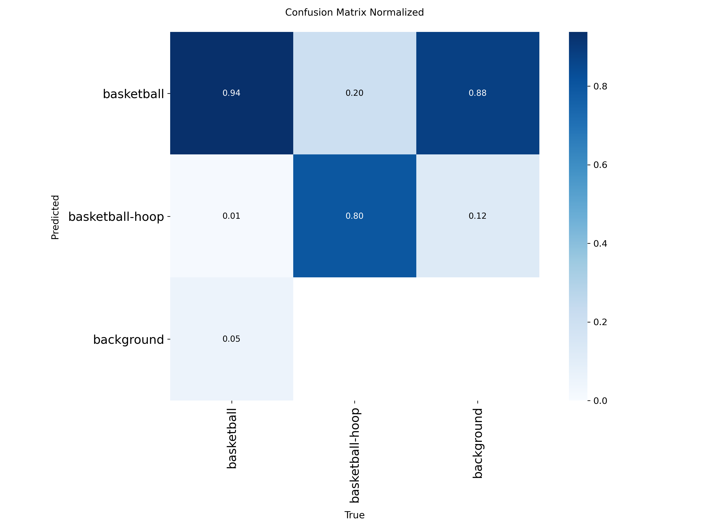 |

*The dataset's own test split (mAP50 0.970) is not reported as a headline number: its frames
come from the same source videos as the training frames, which inflates it.*

## 2. Shot tracker: made / missed on real video

16 phone videos (1080×1920, ~60 fps): indoor and outdoor, camera on the ground or a tripod,
free throws and three-pointers. Every shot was labelled by hand (time + made / missed) before
looking at any tracker output. **Dev** videos (8) were used for debugging and tuning; **test**
videos (8) were scored **once**, after all tuning was frozen. Each half has one video of every
setup.

### Confusion matrix

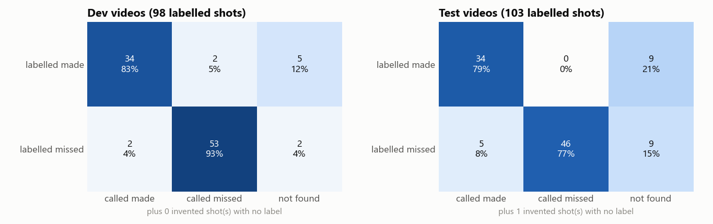

"Not found" means a labelled shot the tracker never detected. On the test videos the tracker
**never called a real make a miss**; its errors are 5 misses called makes and 18 shots not
found (most of them outdoors).

### Precision, recall, F1

| | Dev | **Test** |
|---|---|---|
| **Shot detection** (is there a shot?) | P 1.000 · R 0.929 · **F1 0.963** | P 0.988 · R 0.825 · **F1 0.899** |
| **Made vs missed, on shots found** ("made" = positive) | accuracy 0.956 · P 0.944 · R 0.944 · **F1 0.944** | accuracy 0.941 · P 0.872 · R 1.000 · **F1 0.932** |
| **Made, end to end** (unfound shots count as errors) | P 0.944 · R 0.829 · F1 0.883 | P 0.872 · R 0.791 · F1 0.829 |
| **End-to-end accuracy** (found *and* called right) | **88.8%** | **77.7%** |

### Uncertainty

| | Dev | **Test** |
|---|---|---|
| 95% CI, shots treated as independent (Wilson) | 81.0–93.6% | 68.7–84.6% |
| 95% CI, **resampling whole videos** (bootstrap, 20,000 resamples) | 81.6–95.1% | **61.2–89.9%** |
| Per-video accuracy range | 57–100% | 25–100% |

Shots from the same video share a camera angle, court and lighting, so they are not independent.
Resampling whole videos gives the more honest (wider) interval: with 8 test videos, the true
test accuracy could plausibly be anywhere from about 61% to 90%.

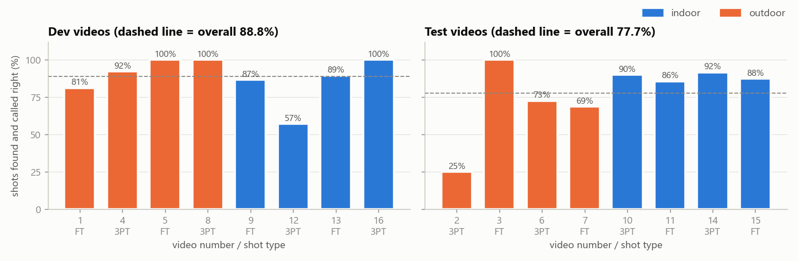

The weak spot is outdoor footage, above all video 2 (outdoor, camera on the ground,
three-pointers): 3 of 12 shots right, almost all of them never found.

## 3. Why no k-fold cross-validation?

Cross-validation estimates how a model generalizes by training and testing on several splits.
It is the right tool for a tabular model trained in seconds; here it was replaced by things
that answer the same question more honestly for this setup:

* **Frames are not independent samples.** Consecutive frames from one video are near
  duplicates. Splitting frames at random (as k-fold does by default) leaks near-copies between
  train and test and inflates the score, which is exactly what happened to the detector
  dataset's own test split. Any split must be **by video**.
* **The detector dataset has only ~4 source videos**, so grouped k-fold would mean 4 folds of
  very different content, each costing ~4 hours of GPU training. Fresh, independent test
  footage is a better use of that time (the roadmap item "own footage").
* **For the shot tracker**, the only tuning was a handful of physical thresholds and rules, chosen
  on the dev videos. The test videos were held out until the end and scored once, so the test
  number was never used to make a decision. The video-level bootstrap above provides the
  "how much would this move on other videos?" estimate that cross-validation would otherwise
  give.

## 4. Judging logic on simulated shots

The make/miss logic is also stress-tested on simulated shots (400 per row: makes, misses,
rim-outs, rim bounces, rattle-ins and "fall past" misses that look centred from the side; half
with the ball hidden near the rim; added pixel noise and dropped detections):

| Detection noise | Missed detections | FPS | Correct |
|---|---|---|---|
| 0 px | 0% | 30 | 96.0% |
| 1.5 px | 10% | 30 | 95.8% |
| 3 px | 20% | 30 | 95.5% |
| 5 px | 30% | 30 | 92.8% |

Nearly all simulated errors are "fall past" misses where the ball is hidden right after the rim:
the net-braking check needs to see the ball falling (100% caught when visible, 0% when hidden).
This measures the logic on the project's own simulator, not real-world accuracy.

## 5. Own iPhone footage (October 2026)

The 16 public videos above are mostly side-on views of one shooter. To test the system on the
footage it is meant for, four indoor sessions were filmed with an iPhone 11 (0.5× ultra-wide lens) on a tripod
(1080p, 60 fps, landscape): **three people taking turns** shooting free throws, mid-range shots
and threes, with the camera on the **sideline**: hoop at the top left of the frame, shooters on the
right, and the rim only about a fifth of the frame below the top edge. The raw
videos are not published (other people appear in them).

| Session | Split | Shots labelled (made) | FT / mid / 3PT | Notes |
|---|---|---|---|---|
| 1 | **Dev** | 43 (16) | 11 / 14 / 18 | two balls in play at times |
| 2 | **Test** | 41 (5) | 10 / 15 / 16 | one ball |
| 3 | **Test** | 39 (21) | 10 / 14 / 15 | one ball |
| 4 | **Test** | 39 (11) | 10 / 15 / 14 | one ball |

As before, every shot was labelled blind (time, made / missed, shot type) before any tracker
output was looked at, the split was fixed before any tuning, and the test sessions were scored
**once** after the code was frozen (label-file hashes and the exact code are kept with the run).
The detector was **not** retrained: it is the same baseline as above.

### What went wrong on this footage (found on the dev session)

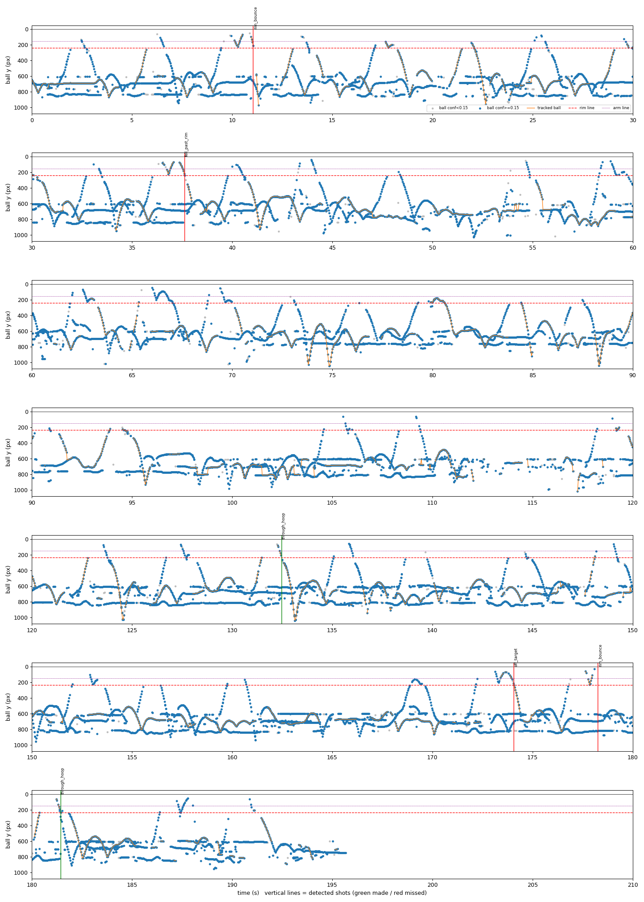

Blue dots are ball detections, the orange line is what the tracker followed, vertical lines are
shots it found. Real shots show up as clean arcs, so the detector does see the ball in flight,
but:

1. **Persistent false "balls" on people.** The detector fires on heads (dark hair, caps), calf
   sleeves and hands at 0.6–0.8 confidence (the flat bands at y ≈ 700 and 840). The tracker
   followed a single target, so once it latched onto a head it never let go.
2. **The ball vanishes near the apex.** With the rim close to the top edge, high arcs leave the frame
   or are lost against the ceiling lights for ~0.5 s; the tracker then restarted on a leg.
3. **Arcs barely clear the arm line.** The camera is low and close, so the hoop box is tall and
   many arcs peak just above the rim: half a hoop-height above it was too strict.

### Tracker v2 (tuned on dev session 1 only)

* **Side tracks and switching:** detections the main track does not take are followed as short
  side tracks; one that rises fast for 4 frames (a released shot) takes over from a main track
  that is barely moving (a head).
* **Waiting for a ball that left through the top:** when the track was heading out of the frame
  it waits up to 1.5 s for the ball to come back down near where it left, instead of restarting
  on whatever is detected meanwhile. The shot logic waits as well.
* **Lower arm line:** 0.5 → 0.15 hoop-heights above the rim.

Each change was checked against the old dev videos so it would not break the side-on case
(replay score 87.8% → 89.8%), and the synthetic benchmark is unchanged.

### Results

| | Dev (session 1, 43 shots) | | **Test (sessions 2–4, 119 shots)** | |
|---|---|---|---|---|
| | old tracker | v2 | old tracker | **v2** |
| **End-to-end accuracy** | 9.3% | 62.8% | 13.4% (95% CI 8–21%) | **37.8% (95% CI 30–47%)** |
| Shot detection precision | 100% | 100% | 95.7% | **100%** |
| Shot detection recall | 16.3% | 69.8% | 18.5% | **44.5%** |
| Make/miss accuracy on found shots | 57.1% | 90.0% | 72.7% | **84.9%** |

Test by session (v2): 11/41, 15/39 and 19/39 shots found and called right (the old tracker found
**no** shots in session 2). Test by shot type (v2): free throws **60.0%** (18/30), mid-range
**38.6%** (17/44), three-pointers **22.2%** (10/45).

What this says:

* The two trackers were scored on the same shots and their intervals do not overlap: the
  improvement is real. But **37.8% is not good enough**, and the dev score (62.8%) overstates it,
  as expected when tuning on one session.
* When v2 finds a shot it is usually right (85%) and it **never invented a shot**. The weakness
  is **recall**: over half the shots are never followed to the hoop, mostly because of the false
  "balls" on people, and threes (highest arcs, longest out of view) suffer most.
* The next step is the detector, not the tracker: retrain it on frames from this kind of footage
  (never from test sessions 2–4) so heads and legs stop looking like balls, and film with more
  room above the rim.
* Sessions 2–4 are now **used**. Like the public test videos, they will not be tuned on, and
  new claims need new footage.
* Tracker v2 has not been re-scored on the public test videos; the 77.7% in section 2 is the
  original tracker. (Section 6 re-tests the current system, with the retrained detector, on both
  test sets.)

## 6. Current system: retrained detector + tracker v2 (October 2026)

The current system scores **92.2%** on the public test videos (was 77.7%) and **78.2%** on our own
test sessions (was 37.8% with the old detector). Both test sets had been scored before, so these
are **re-tests of a frozen system**, not first looks: nothing was tuned on them and the code,
detector and labels were fingerprinted before the runs, but the low 37.8% is what prompted the
retraining. A clean first-look number needs newly filmed, blind-labelled sessions.

### Detector v2

Fine-tuned from the original detector for 12 epochs (960 px, batch 2) on 8,347 images: the hotshot
set plus 5,324 frames of [Basketball Detection v6](https://universe.roboflow.com/hooper-ibdsr/basketball-detection-v6)
by Hooper (CC BY 4.0; phone video of gyms with many people on court; every 8th of 48,110 frames).
Its hoop boxes cover the rim only, so they became a separate `rim_only` class the tracker ignores;
its boxes around people were dropped (`scripts/build_combined_dataset.py`). Before retraining, the
original detector found only 53 of 242 labelled balls in 300 random Hooper frames at 0.5 confidence.

| Setting | Value |
|---|---|
| Model | YOLOv8s, fine-tuned from detector v1 (`runs/detect/baseline/weights/best.pt`) |
| Data | 8,347 train / 880 validation images (hotshot + Hooper), classes `ball`, `hoop`, `rim_only` |
| Epochs | 12 (early-stopping patience 5, not triggered) |
| Best epoch | **12**, the last one (same fitness criterion as section 1) |
| Batch / image size | 2 / 960 px, mixed precision (batch 4 ran out of the GPU's 6 GB) |
| Training time | 8.0 h on a GTX 1660 SUPER (6 GB) |

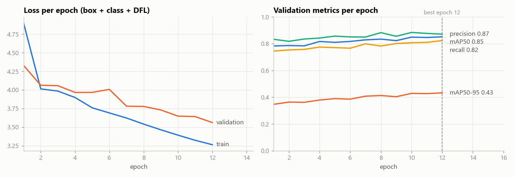

* Both losses fall over all 12 epochs and validation loss never turns upward, so there is no sign
  of overfitting.
* The best epoch is the last one and validation mAP50-95 was still rising (0.35 to 0.43), so
  training was stopped by time, not because the model had converged. More epochs would likely add
  a little.

Best-epoch validation metrics (880 images, Hooper frames held out in whole 2,000-frame blocks):

| | Precision | Recall | mAP50 | mAP50-95 |
|---|---|---|---|---|
| All classes | 0.871 | 0.823 | 0.851 | 0.433 |
| Ball | 0.865 | 0.637 | 0.747 | 0.441 |
| Hoop (rim + net) | 0.883 | 0.982 | 0.931 | 0.390 |
| Rim only | 0.867 | 0.850 | 0.876 | 0.466 |

These are not comparable with section 1: the validation set is different and much harder (small,
distant balls in busy gyms). What the change did to shot calls is in the re-tests below.

| Precision-recall curve | F1 vs confidence | Confusion matrix (normalized) |
|---|---|---|
| 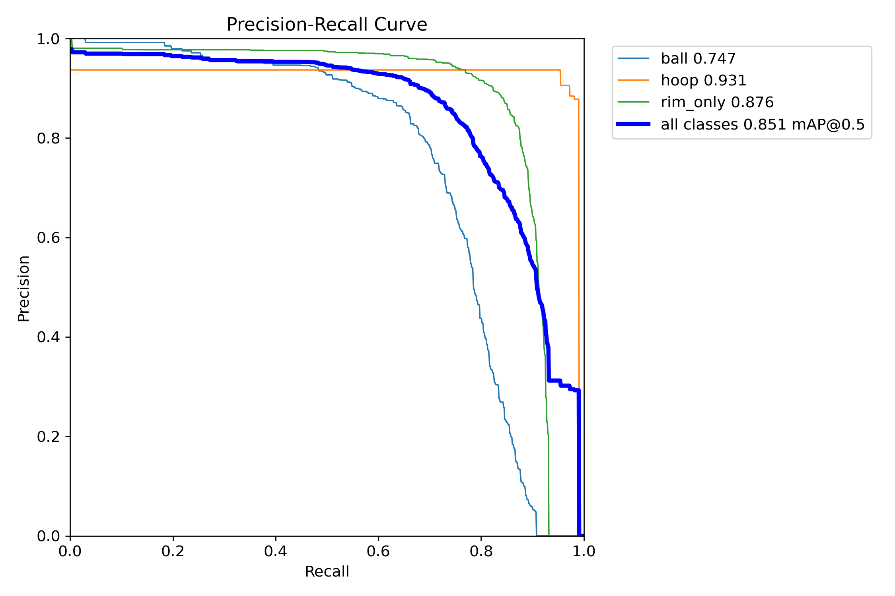 | 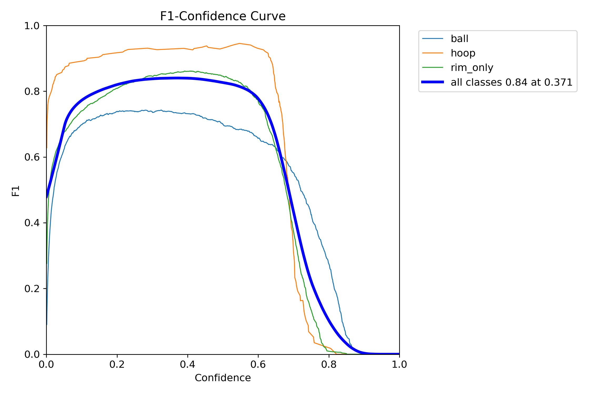 | 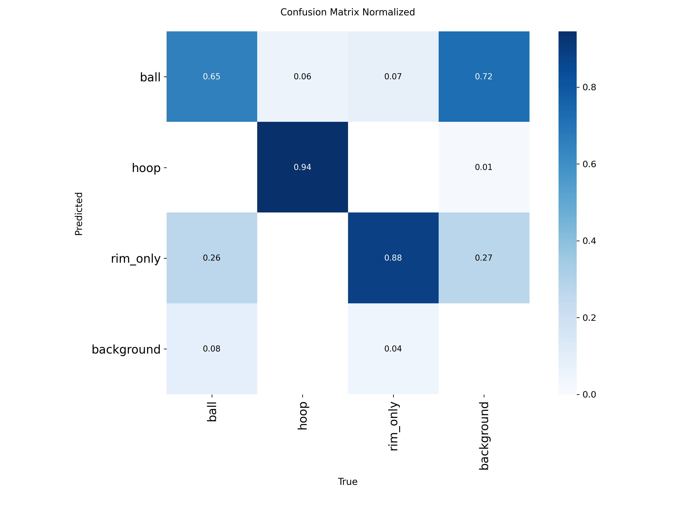 |

### Frozen re-test: public test videos (103 shots)

Same settings as section 2 (1280 px, every 2nd frame, same hoop boxes).

| | Original | **Current system** |
|---|---|---|
| End-to-end accuracy (95% CI) | 77.7% (69–85%) | **92.2% (85–96%)** |
| Shot detection precision / recall | 98.8% / 82.5% | 99.0% / 96.1% |
| Make/miss accuracy on found shots | 94.1% | 96.0% |
| Outdoor / indoor | 66.7% / 88.5% | 90.2% / 94.2% |
| Free throws / three-pointers | 84.5% / 68.9% | 89.7% / 95.6% |
| Mean abs. error in makes per video | 1.00 | 0.62 |

Video 2 (outdoor, ground camera, threes), the weakest before, went from 3 to 11 of 12 shots right.

### Frozen re-test: own sessions 2–4 (119 shots)

Same settings as section 5 (960 px, every frame).

| | Old detector, original tracker | Old detector, tracker v2 | **Current system** |
|---|---|---|---|
| End-to-end accuracy (95% CI) | 13.4% (8–21%) | 37.8% (30–47%) | **78.2% (70–85%)** |
| Shot detection precision / recall | 95.7% / 18.5% | 100% / 44.5% | 98.1% / 86.6% |
| Make/miss accuracy on found shots | 72.7% | 84.9% | 90.3% |
| Free throws / mid-range / threes | | 60.0% / 38.6% / 22.2% | 76.7% / 70.5% / 86.7% |

Shots found per session: 27/41, 37/39, 39/39; session 2 holds 14 of the 16 shots not found.

### Each tracker change, on dev footage

Replays with the new detector at 960 px:

| Tracker | Old dev videos (98 shots) | Own dev session 1 (43 shots) |
|---|---|---|
| Original | 89.8% | 62.8% |
| Tracker v2 | 89.8% | 86.0% |
| v2 without switching / top-exit wait / lower arm line | 89.8% / 89.8% / 89.8% | 74.4% / 76.7% / 79.1% |

On the public dev videos the changes alter nothing (the same shots right and wrong); on our own
footage (rim near the top edge, people on court) each adds 7–12 points. An earlier comparison that suggested tracker v2 lost 5 points
on the old videos had run those portrait videos at 960 px instead of 1280 px; run settings are now
saved per run and `compare_runs.py` warns when they differ.

### Speed vs accuracy (for a phone app, dev footage)

End-to-end accuracy, old dev videos (portrait) / own session 1 (landscape):

| Image size | 60 fps | 30 fps | 20 fps | PC time per frame |
|---|---|---|---|---|
| 640 px | 80.6% / 88.4% | 84.7% / 88.4% | 84.7% / 83.7% | 12.7 ms |
| 960 px | 89.8% / 86.0% | 88.8% / 88.4% | 90.8% / 88.4% | 19.4 ms |
| 1280 px | 88.8% / 88.4% | 94.9% / 86.0% | 91.8% / 88.4% | 31.6 ms |

Frame rate barely matters, and landscape footage holds at 640 px; portrait video needs at least
960 px. Target for the app: landscape filming, 960 px at 20–30 fps, with 640 px at 30 fps as the
fallback. Speed on the iPhone itself is not yet measured. Differences of 2–3 points here are one or
two shots.

## 7. Balls that leave through the top of the frame (dev, October 2026)

**Sessions 2–4 are no longer test data.** They had been scored twice (sections 5 and 6), so they could
not give a clean first-look number anymore, and their failures are worth studying. From here on all
four own sessions are dev footage; the next test number comes from newly filmed sessions, scored once.

### What went wrong in session 2

Session 2 held 14 of the 16 shots the current system never found. In 11 of them the ball left
through the top of the frame (the rim sits only about a fifth of the frame below the top edge) and
was out of view for 0.8–1.2 s:

* **8 shots (all the mid-range shots between 73 and 119 s): the tracker never took the ball back.**
  They were shot close to the camera (ball about 100 px wide when it left the frame, against about
  50 px on free throws), so the ball flew away from the camera and, by perspective, slowed down on
  screen while out of view: 1,000–1,800 px/s sideways when it left, 800–970 px/s on average while
  hidden. The constant-velocity guess put the re-entry 400–900 px past where the ball actually came
  back down, right over the hoop, so the tracker ignored it and only picked the ball up again near
  the floor.
* **3 shots: the tracker took the ball back, but the shot logic only saw the falling half.** It
  judges the latest continuous run of observations, and the first points after re-entry are a ball
  cut off by the top edge (box centre too low), so the short fall looked "not parabolic".

### The fixes

* **Tracker:** when a ball that left through the top was heading for the hoop, the search for it
  also covers everything between the exit point and one hoop-width past the hoop. The pipeline now
  works out the hoop before tracking, so the tracker can use it.
* **Shot logic:** a gap that starts with the ball rising out through the top and ends with it back
  above the rim (within `top_exit_wait_s`) is one flight, so the fit sees the whole arc. A ball
  coming back down from above the frame is no longer read as "came back up off the rim".

### Results (replays of saved detections, detector v2, 960 px)

| | Before | After |
|---|---|---|
| Session 2 | 58.5% (25 of 41 shots found) | **82.9%** (39 of 41 found) |
| Sessions 1, 3, 4 | 86.0% / 84.6% / 89.7% | identical (same shots right and wrong) |
| **All own sessions (162 shots)** | 79.6% (95% CI 73–85%), recall 89.5% | **85.8% (80–90%)**, recall 98.1% |
| Public dev videos (98 shots, 1280 px) | 94.9% | 94.9% (identical) |

These are dev numbers: the fixes were designed by looking at session 2.

### Then: made / missed calls

With shots now found, 20 of the 23 errors left on own footage were wrong made/missed calls. For
every matched dev shot (255: own sessions and public dev videos) the ball's motion in the 0.45 s
after it crossed the rim line was measured and compared between right and wrong calls:

* **Misses called made, bounced back out.** Five of them moved back towards the shooter by 0.9–1.4
  hoop widths while still at net height: they hit the back of the rim or the board and fell away
  beside the net. No correctly called make moved back more than 0.62 hoop widths. New rule: moving
  back by `back_out_frac` = 0.75 hoop widths before dropping below the net is a miss (`rim_bounce`).
* **Makes called "fell past the rim".** The net-braking check demoted a make whenever the ball was
  not slowed at all after the crossing (falling speed after / before >= 1.0). Eight own-footage
  makes reached 1.1–1.35 going through the net; balls that really fell past were mostly 1.8–2.7,
  two at 1.25. `net_brake_ratio` was raised to 1.3, chosen with the simulator in mind:

| Rule A (bounced back out) / net-braking ratio | Own footage (162) | Public dev (98) | Synthetic, noise 0 / 1.5 / 3 / 5 px (fall-past caught) |
|---|---|---|---|
| Before: off / 1.0 | 85.8% | 94.9% | 96.0 / 95.8 / 95.5 / 92.8% (63 / 63 / 63 / 46%) |
| On / 1.0 | 88.9% | 94.9% | unchanged |
| On / 1.2 | 90.1% | 94.9% | 96.0 / 95.8 / 95.5 / 92.2% (63 / 63 / 63 / 41%) |
| **On / 1.3 (chosen)** | **92.0%** | **93.9%** | 96.0 / 95.8 / 95.5 / 91.5% (63 / 63 / 63 / 34%) |
| On / 1.5 | 93.2% | 93.9% | 95.8 / 95.0 / 94.2 / 90.2% (61 / 56 / 51 / 22%) |

Rule A costs nothing anywhere. The ratio is a trade-off: 1.3 keeps the simulator's fall-past
detection intact at realistic noise and costs one public dev shot; 1.5 would add two more own-footage
shots but weaken fall-past detection at every noise level. These are dev numbers, tuned on the very
shots they are measured on, so they overstate what fresh footage will show.

Still unexplained: 9 misses called made (rim rattles, balls lost right at the rim) with nothing
that separates them from correct makes in these measurements.

## 8. More detector training did not help shot calls (v3, v4)

Two retrained detectors were compared with detector v2 on the **same tracking and judging code**,
on dev footage only. Both were fine-tuned from v2's weights for 8 more epochs at a small learning
rate (AdamW 0.0003, no warm-up; `scripts/train_detector.py --optimizer --lr0 --lrf --warmup-epochs`).

| | v2 (kept) | v3: 8 more epochs, same data | v4: + 600 hand-checked own frames (x3) |
|---|---|---|---|
| Validation mAP50 / mAP50-95 (880 images) | 0.851 / 0.433 | **0.866 / 0.442** | 0.849 / 0.424 |
| Own sessions, shot calls | 92.0% (1-4) | 90.7% (1-4) | 89.7% (session 3, held out) vs v2 92.3% |
| Public dev videos, shot calls | **93.9%** | 88.8% | 85.7% |

* **v3**: better on the validation images, which come from the same datasets as the training
  images, but it saw the ball in fewer frames of the public videos (up to 5 points fewer), losing
  shots there. More epochs on the same data specialised it.
* **v4** was trained on 600 frames from own sessions 1, 2 and 4 with every ball and hoop boxed by hand
  (`scripts/sample_box_frames.py`, `scripts/box_labeler.py`, `scripts/add_own_frames.py`); session 3
  was held out. On session 3's 200 hand-labelled frames it is the better detector (balls found at
  confidence 0.15: 87.7% vs 82.4%; false balls 5 vs 12; hoop box right in 200/200 frames vs 0/200,
  since v2 calls gym hoops `rim_only`). But it saw the ball in 4-16 points fewer frames on every
  public video and lost 8 public dev shots, and it does not find the hoop in a second gym at all
  (section 10): one gym's frames taught it one gym.
* The hand labels also measured v2 directly: on 800 frames picked to be hard, v2 found 79.8% of the
  860 balls and drew 10 boxes that were not balls. Its weakness is balls in flight, not false balls.
* Validation mAP is not the deciding number; shot calls on footage the model never saw are.
  v2 stays the detector. Training on footage from many places, each frame counted once, is the
  route for a future detector.

Frame labelling convention for own footage: every ball (in flight, in hands, on the floor; only the
visible part when cut off), the hoop being shot at as rim plus net; far-wall hoops were not boxed.

## 9. First-look test in a second gym (October 2026)

Seven new sessions were filmed in a **second gym** that no detector, rule or threshold had seen (one
shooter, one ball, iPhone 11 0.5x lens on a tripod, rim about a third down the frame). The split was
fixed before anything ran on them: sessions 6, 7 and 8 (30 free throws, 30 mid-range, 30 threes) are
**test**; four freestyle sessions (5, 9, 10, 11; 102 shots) are dev. Shots were labelled blind, the
hoop marked by hand (as in the app), and the system frozen and fingerprinted before a single run:
Python commit c78a239, detector v2 (sha256 e90e448a...), 960 px, every frame, ball confidence 0.15.

| Test sessions 6-8, 90 shots | Result |
|---|---|
| **End-to-end accuracy** (found and called right) | **85.6%** (95% CI 77-91%) |
| Shot detection precision / recall | 100% / 96.7% (87 of 90 found, none invented) |
| Make/miss accuracy on found shots | 88.5% (9 makes called missed, 1 miss called made) |
| Free throws / mid-range / threes | 76.7% / 90.0% / 90.0% |

This is the cleanest number in the project: new place, new camera positions, frozen system, scored
once. 8 of the 13 errors are makes demoted by the "fell past the rim" check (4 free throws, 2 mid-range,
2 threes); 3 shots were not found and 2 more were wrong calls (a make called a rim bounce, a miss called
rattled in). `scripts/shot_report.py` draws every shot of this run (what the detector saw, the path
followed, the call) for review: [every test shot, cropped to the hoop](shot_report/).
Sessions 6-8 are now used; changes after this are dev results until new footage is filmed.

## 10. After the test: the net catches the ball (dev), and finding the hoop automatically

**Net catch.** Studied on dev footage only (own sessions 1-5, 9-11 and the public dev videos): the
makes wrongly demoted as "fell past the rim" reached the rim moving fast sideways (6.5-8 hoop
widths/s) and lost nearly all of it after the crossing (kept -0.2 to 0.35 of it): the net stopped
them. Balls that really fell past kept moving sideways (the one fast one kept 1.3x). New check: a
make is not demoted when the ball came in at `net_catch_min_vx` = 3 widths/s or more and kept at
most `net_catch_ratio` = 0.5 of that sideways speed.

| Dev | Before | With the net-catch check |
|---|---|---|
| Second gym, sessions 5, 9-11 (102 shots) | 89.2% | **93.1%** |
| First gym, sessions 1-4 (162 shots) | 92.0% | 93.2% |
| Public dev videos (98 shots) | 93.9% | 93.9% |
| Synthetic benchmark (fall-past caught) | 96.0 / 95.8 / 95.5 / 91.5% | identical |

Dev numbers: the rule was designed on these shots. It needs new test footage to be measured.

**Finding the hoop.** Detector v2 sees gym hoops (and the hoops in the public videos) as `rim_only`, a
rim box without the net, and almost never as the full hoop class. The hoop finder
(`calibration.find_hoop`, used by `--calibrate-hoop`; a hand-marked hoop still overrides it) takes the
biggest rim in each of 60 frames (the nearest hoop looks biggest), the median over frames, and extends
it down over the net by 1.27 rim widths, the median of the hand-marked dev hoops. If the full hoop class
is found, the earlier consensus method is used instead. It also reports how clear the choice was:
the area of the biggest rim at least one rim width away from the chosen one, relative to it.

| Hand-marked hoop vs found hoop | First gym (1-4) | Second gym dev (5, 9-11) | Second gym test (6-8) |
|---|---|---|---|
| Biggest rim + net (detector v2) | right hoop 4/4, IoU 0.93 | 4/4, IoU 0.81-0.91 | 3/3, IoU 0.87-0.92 |
| Detector v4's hoop class | 4/4, 0.97 (trained there) | 1/4 | 0/3 (not detected) |
| "Second hoop" ratio | 0.06-0.08 (small far-wall hoop) | 0.83 in session 11 only: a second backboard of similar size in view | 0.04-0.06 |

On the public dev videos it finds the same hoop as the boxes used for every earlier result (IoU 0.62-0.85;
looser, because those portrait videos see the net from other angles).

Shot calls with the found hoop instead of the hand-marked one (dev replays, current code):

| | Hand-marked hoop | Found hoop |
|---|---|---|
| First gym, sessions 1-4 | 93.2% | 93.2% (identical) |
| Public dev videos | 93.9% | 93.9% (identical) |
| Second gym dev, sessions 5, 9-11 | 93.1% | 90.2% (3 shots: 2 not found, 1 wrong call) |

The second gym's nets are shorter (hand-marked boxes 1.15-1.31 times as tall as wide, against 1.32-1.38 in
the first gym), so the found box is 10-20 px too tall there, and the shot logic measures its thresholds
in hoop heights. In the app the found hoop is therefore a suggestion the player confirms (pulling the
bottom edge to the bottom of the net). The lasting fix is to measure the shot rules in rim widths,
which the detector finds consistently, instead of hoop heights, which depend on the net.

## 11. Shot rules in rim widths instead of hoop heights (dev)

Every distance in the shot logic (rim line, arm line, fit tolerances, rebound and re-entry margins,
falling speeds) used to be measured in heights of the hoop box. That height is the rim plus however
much net the box covers, which varies: hoop boxes were 0.97-1.60 times as tall as wide across our
videos, and the automatically found hoop (section 10) came out 10-20 px taller than the hand-marked
one in the second gym. The rim's width is detected consistently, so all distances are now measured
in rim widths: one "hoop height" in the settings = `hoop_aspect` rim widths, chosen on dev footage:

| Dev shot calls | Hand-marked hoop: gym 1 / gym 2 / public | Found hoop: gym 1 / gym 2 / public | Synthetic 0 / 3 / 5 px |
|---|---|---|---|
| Box height (before) | 151 / 95 / 92 | 151 / 92 / 92 | 96.0 / 95.5 / 91.5% |
| **`hoop_aspect` 1.0 (chosen)** | **152 / 97 / 92** | **152 / 97 / 91** | 96.0 / 94.0 / 91.2% |
| 1.15 | 150 / 95 / 91 | 150 / 94 / 93 | 94.0 / 93.5 / 90.5% |
| 1.3 | 152 / 94 / 91 | 151 / 92 / 92 | 88.0 / 92.0 / 87.2% |
| 1.45 | 150 / 91 / 88 | 150 / 92 / 92 | 83.5 / 87.2 / 86.0% |

(Out of 162 / 102 / 98 shots.) With rim widths the found hoop does as well as the hand-marked one in
the second gym (97 of 102 each, up from 92), so finding the hoop automatically no longer costs shots
there. The simulator's hoop box is unusually wide (70 x 50 px), so its benchmark moves the most.
Dev numbers, one value picked from four on these shots: new test footage is the real check.

## 12. Shots off the front rim (dev)

Three test shots were not counted, all of which hit the front rim first (one came back to the
shooter, one rolled forward and fell outside the net, one went off the backboard and in; README).
Off the front rim a ball is deflected sideways rather than bounced up, so the bounce detector does not
fire, the tracker follows the ball on, and arc + deflection + fall is no parabola: the shot logic
discarded the whole attempt as "not parabolic". Now, when a flight fails that check, the arc up to
where the ball first reached the rim (within one rim width of the hoop's centre, from 0.6 rim widths
above the rim line to 0.2 below; `rim_contact_above` / `rim_contact_below`) is fitted on its own. If
that is a clean arc, the shot is counted as one that hit the rim and judged by where the ball goes:
through the hoop (made, "rattled in"), outside it (missed) or back up (rim out).

| Dev | Without | With |
|---|---|---|
| First gym, sessions 1-4 (hand / found hoop) | 152 / 152 | 153 / 153 |
| Second gym dev, sessions 5, 9-11 | 97 / 97 | 97 / 97 |
| Public dev videos (hand / found hoop) | 92 / 91 | 92 / 92 |
| Synthetic benchmark | 96.0 / 94.0 / 91.2% | identical |

On dev it was used once (session 2, 3:25: a miss off the rim, now counted and called missed) and
changed no other call. Dev footage has few front-rim shots, so how much it helps needs new footage.
