# Shot report: test sessions 6-8 (second gym)

The first-look test of RESULTS.md section 9: the system frozen at commit c78a239 with detector v2, labels made blind, scored once: 77 of 90 shots right (85.6%). Changes made since then (net catch, rim widths, front-rim shots) are not reflected here; they need new test footage.

Every labelled shot, as the system saw it, cropped to the hoop so no players are shown. On each picture:
dots = ball detections (blue early, yellow late), orange = the path the tracker followed, green = hoop box,
red = rim line, white x = where the ball crossed it. Header: your label against the system's call.

| Session | Shots | Correct | Wrong call | Not found | Extra | Accuracy |
|---|---|---|---|---|---|---|
| Session 6 | 30 | 23 | 5 | 2 | 0 | **76.7%** |
| Session 7 | 30 | 27 | 2 | 1 | 0 | **90.0%** |
| Session 8 | 30 | 27 | 3 | 0 | 0 | **90.0%** |

| Shot type | Shots | Correct | Accuracy |
|---|---|---|---|
| 3PT | 30 | 27 | **90.0%** |
| FT | 30 | 23 | **76.7%** |
| mid | 30 | 27 | **90.0%** |

## Mistakes (13)

<table>
<tr><td valign="top">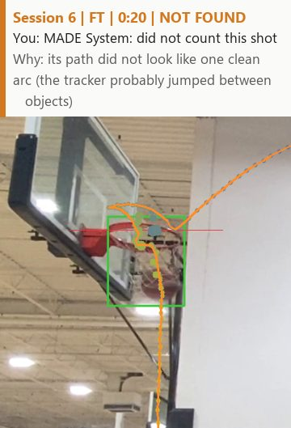 

slow motion
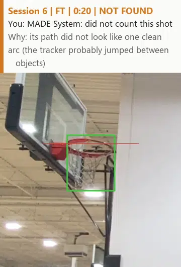
</td><td valign="top">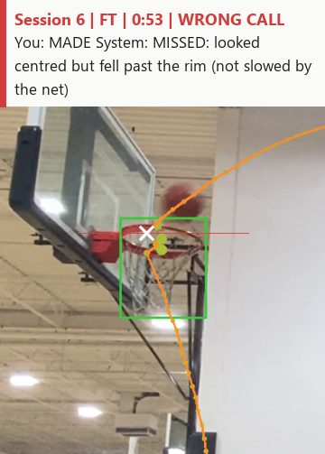 

slow motion

</td><td valign="top">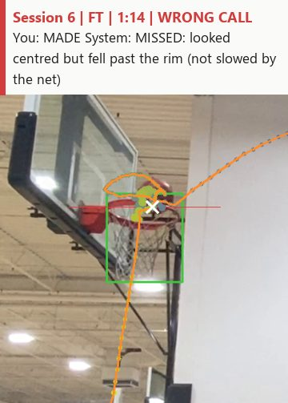 

slow motion

</td></tr>
<tr><td valign="top"> 

slow motion
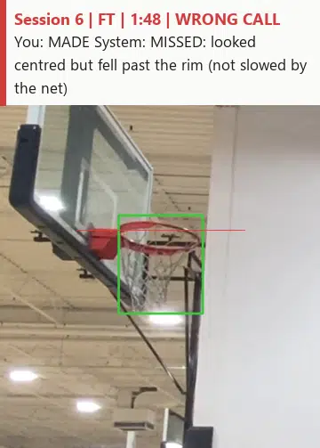
</td><td valign="top">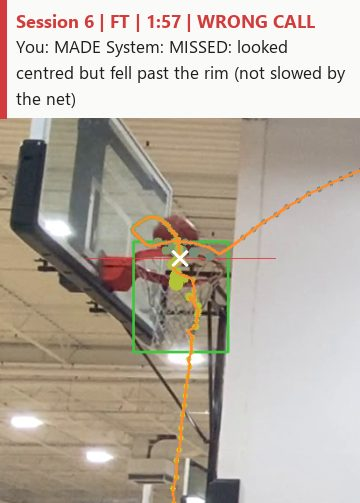 

slow motion
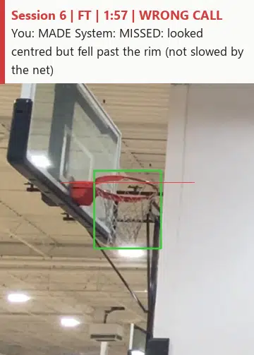
</td><td valign="top">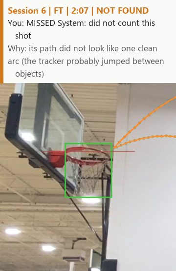 

slow motion
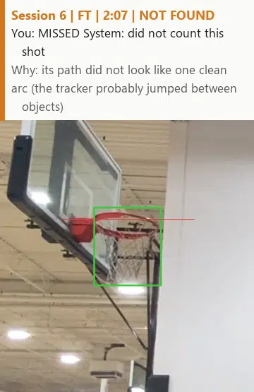
</td></tr>
<tr><td valign="top">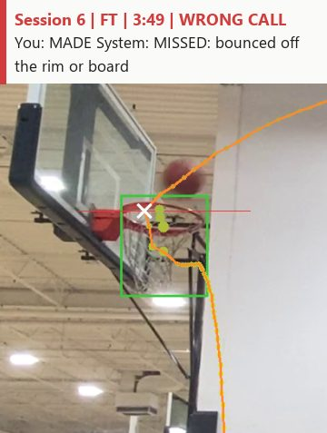 

slow motion
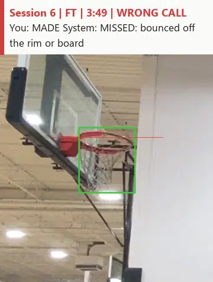
</td><td valign="top">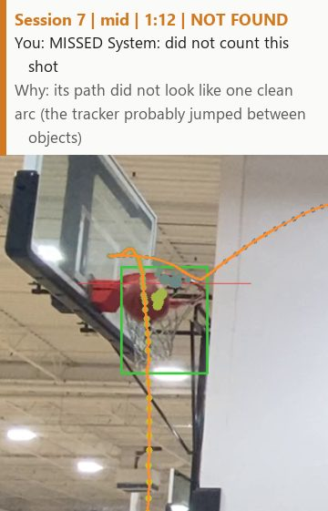 

slow motion
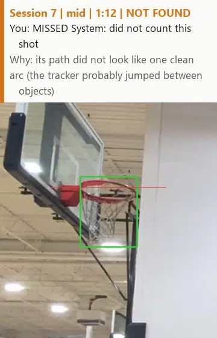
</td><td valign="top">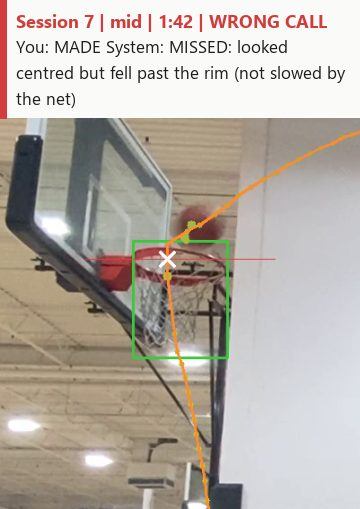 

slow motion

</td></tr>
<tr><td valign="top">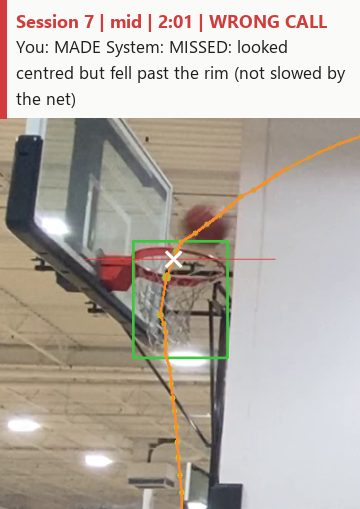 

slow motion
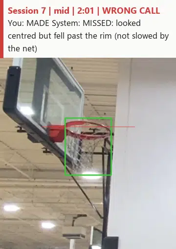
</td><td valign="top">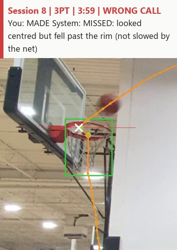 

slow motion

</td><td valign="top">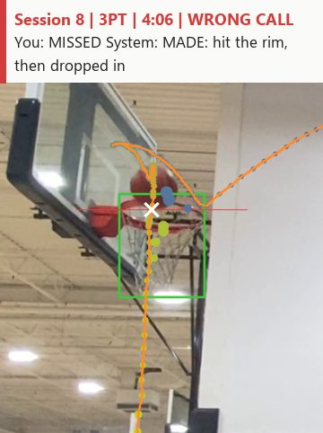 

slow motion
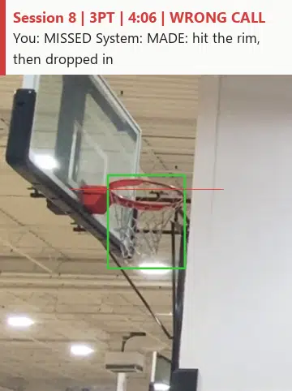
</td></tr>
<tr><td valign="top">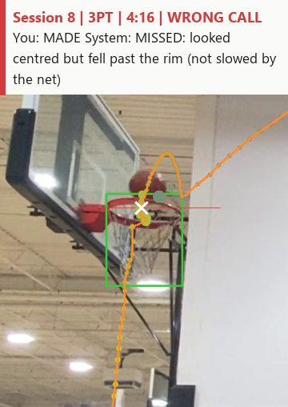 

slow motion
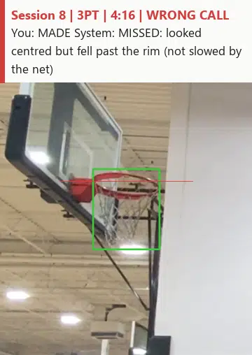
</td></tr>
</table>

## Correct calls (77)

Session 6 (23 shots)

<table>
<tr><td valign="top"></td><td valign="top"></td><td valign="top">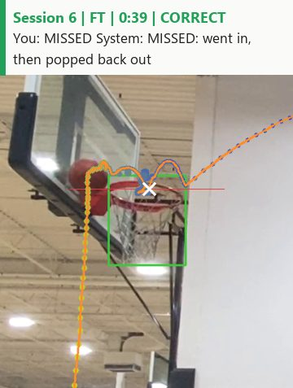</td></tr>
<tr><td valign="top">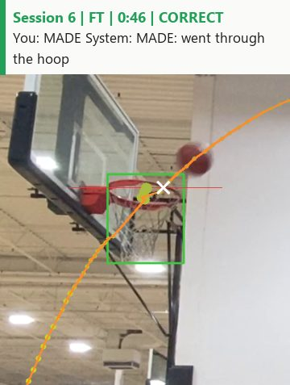</td><td valign="top">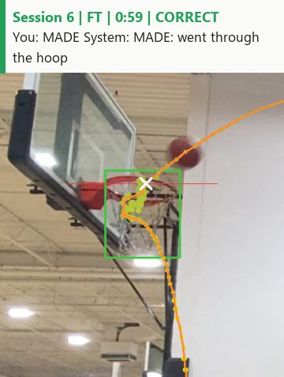</td><td valign="top">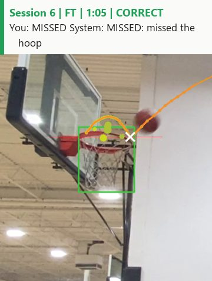</td></tr>
<tr><td valign="top"></td><td valign="top">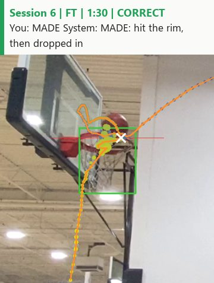</td><td valign="top">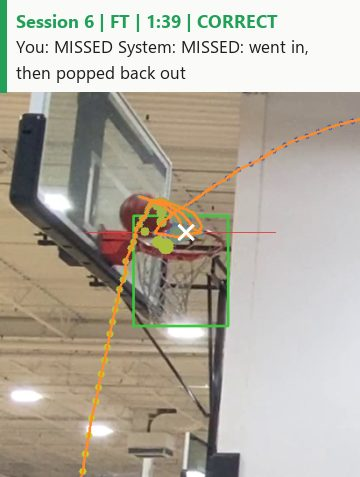</td></tr>
<tr><td valign="top">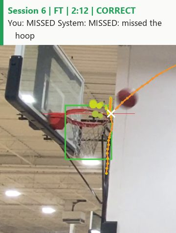</td><td valign="top"></td><td valign="top">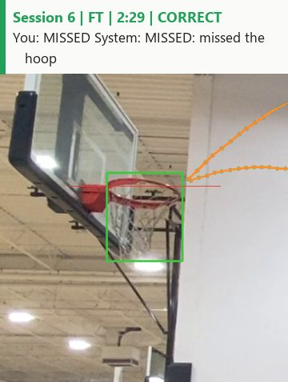</td></tr>
<tr><td valign="top">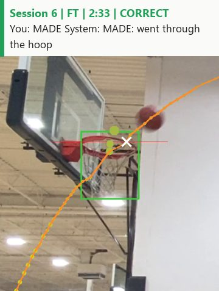</td><td valign="top">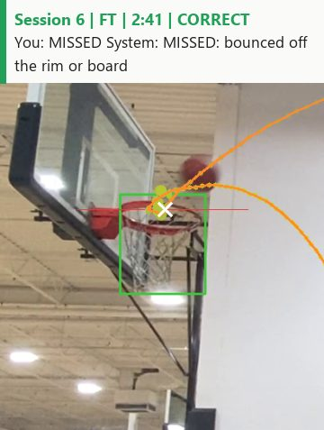</td><td valign="top">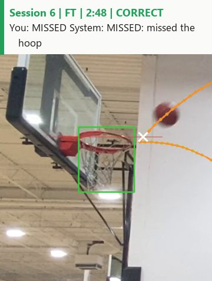</td></tr>
<tr><td valign="top"></td><td valign="top">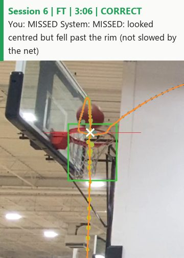</td><td valign="top">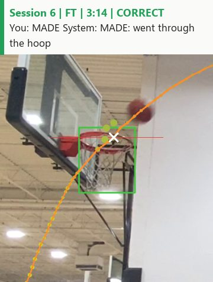</td></tr>
<tr><td valign="top"></td><td valign="top">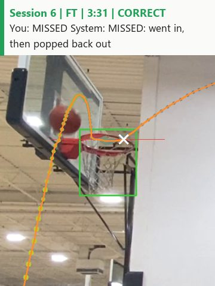</td><td valign="top">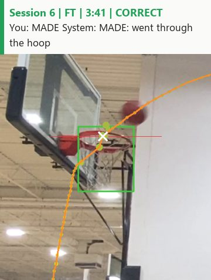</td></tr>
<tr><td valign="top">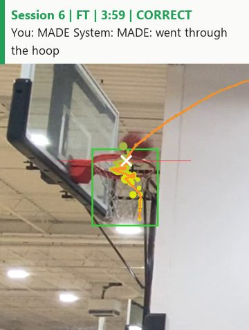</td><td valign="top">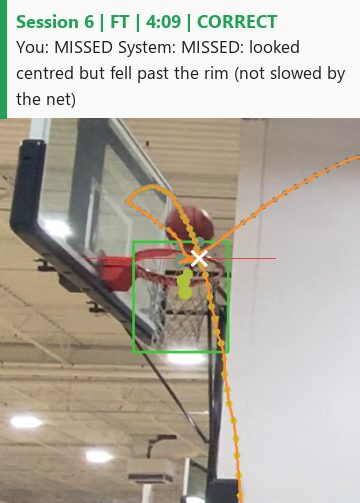</td></tr>
</table>

Session 7 (27 shots)

<table>
<tr><td valign="top">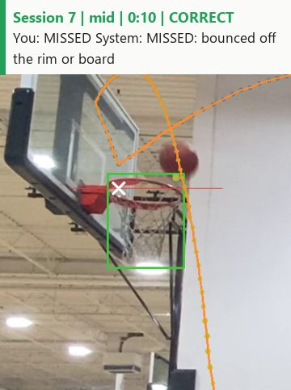</td><td valign="top">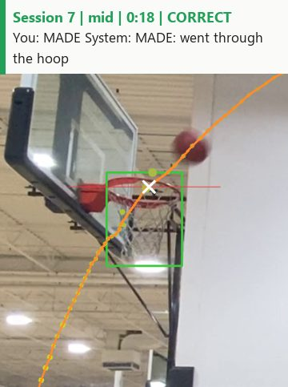</td><td valign="top">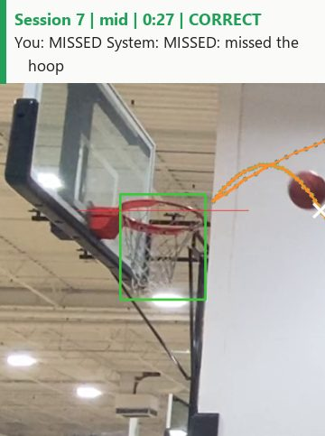</td></tr>
<tr><td valign="top"></td><td valign="top">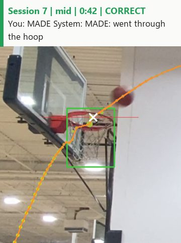</td><td valign="top"></td></tr>
<tr><td valign="top"></td><td valign="top">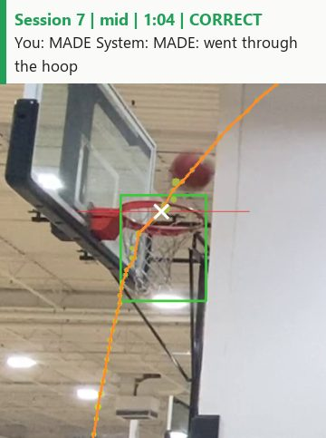</td><td valign="top"></td></tr>
<tr><td valign="top">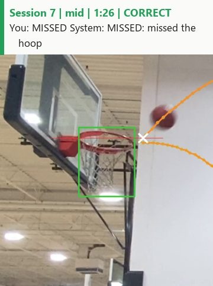</td><td valign="top">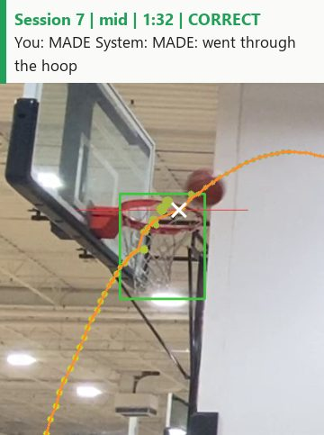</td><td valign="top">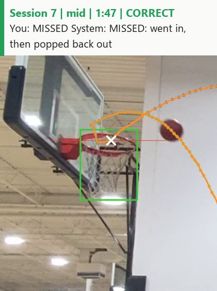</td></tr>
<tr><td valign="top">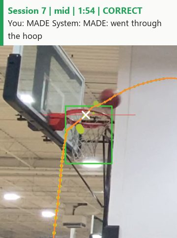</td><td valign="top">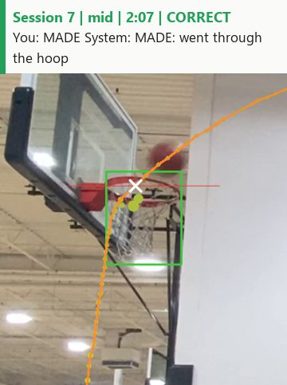</td><td valign="top">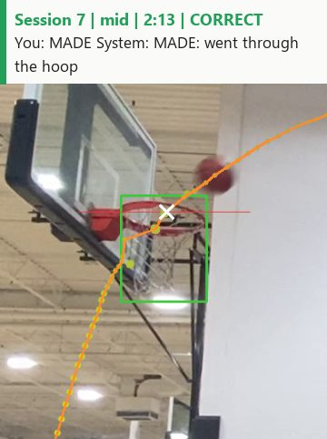</td></tr>
<tr><td valign="top">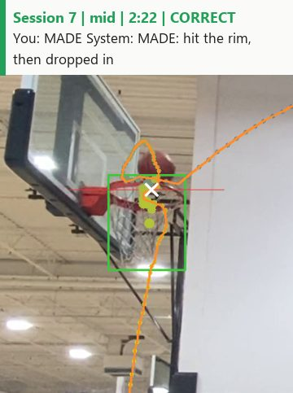</td><td valign="top"></td><td valign="top"></td></tr>
<tr><td valign="top"></td><td valign="top"></td><td valign="top"></td></tr>
<tr><td valign="top"></td><td valign="top"></td><td valign="top"></td></tr>
<tr><td valign="top"></td><td valign="top"></td><td valign="top"></td></tr>
</table>

Session 8 (27 shots)

<table>
<tr><td valign="top"></td><td valign="top"></td><td valign="top"></td></tr>
<tr><td valign="top"></td><td valign="top"></td><td valign="top"></td></tr>
<tr><td valign="top"></td><td valign="top"></td><td valign="top"></td></tr>
<tr><td valign="top"></td><td valign="top"></td><td valign="top"></td></tr>
<tr><td valign="top"></td><td valign="top"></td><td valign="top"></td></tr>
<tr><td valign="top"></td><td valign="top"></td><td valign="top"></td></tr>
<tr><td valign="top"></td><td valign="top"></td><td valign="top"></td></tr>
<tr><td valign="top"></td><td valign="top"></td><td valign="top"></td></tr>
<tr><td valign="top"></td><td valign="top"></td><td valign="top"></td></tr>
</table>

Made with `scripts/shot_report.py --public`. Full-frame cards (whole court and players) can be made locally
without `--public`.
